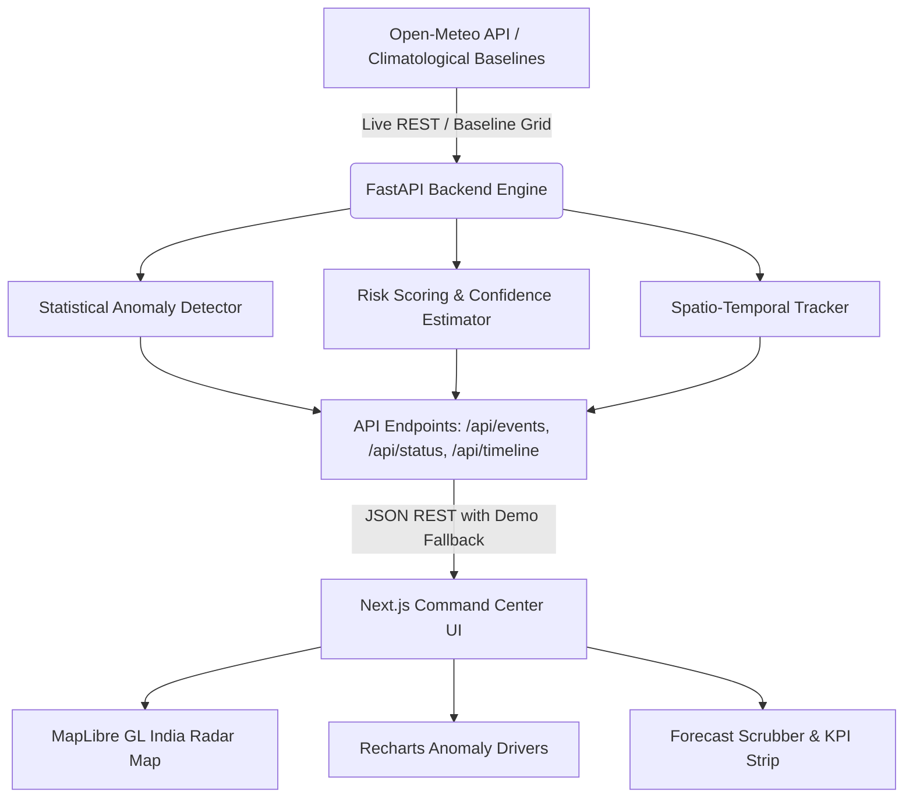

# 🌪️ AeroWatch — AI-Powered Extreme Weather Intelligence & Command Center

> **SIH26078**: AI-Driven Spatio-Temporal Tracking of Extreme Weather Anomalies in Medium-Range Forecasts  
> **Product**: AeroWatch Operational Command Center

---

## 🛰️ Executive Overview

**AeroWatch** is a next-generation meteorological command-and-control intelligence platform designed to detect, track, and forecast extreme weather anomalies across the Indian subcontinent. Combining explainable statistical anomaly engines, multi-dimensional risk index scoring, and interactive MapLibre spatio-temporal tracking, AeroWatch equips emergency responders and meteorological agencies with early situational awareness.

---

## ⚡ Key Features

- **🗺️ Interactive Spatio-Temporal Radar Map**: High-performance MapLibre GL visualization of India with real-time vector boundaries, multi-tier risk halos, and forecast trajectory tracks (T0 to T+72h).
- **📊 Real-time Explainable Anomaly Detection**: Z-score calculations across Temperature, Rainfall, Wind Velocity, and Barometric Pressure against IMD climatological baselines.
- **🛡️ 0–100 Weighted Risk Scoring**: Normalized multi-variate risk index with confidence scoring and severity categorization (LOW, MODERATE, ELEVATED, HIGH, SEVERE).
- **⏱️ Multi-Interval Forecast Timeline Scrubber**: Scrub across medium-range timesteps (T0, +12h, +24h, +36h, +48h, +72h) with trajectory playback and coordinate interpolation.
- **🔄 Dual Mode (LIVE / DEMO)**: Operates in **LIVE MODE** via Open-Meteo (₹0 cost, no API keys needed) with automatic graceful fallback to **DEMO MODE** for offline simulations.
- **🎨 Stitch "AeroDark Intelligence" Design**: Professional command-and-control visual language with CRT scanlines, HUD brackets, and telemetry gauges.

---

## 🏗️ System Architecture



---

## 🚀 Quick Start Guide

### Prerequisites
- **Node.js**: v18.0 or higher
- **Python**: v3.9 or higher

---

### 1. Backend Setup (FastAPI)

```powershell
# Open terminal at project root
cd backend

# Install dependencies
pip install -r requirements.txt

# Launch FastAPI server (Runs on http://localhost:8000)
python -m uvicorn backend.main:app --reload --host 0.0.0.0 --port 8000
```

Verify backend health at: [http://localhost:8000/health](http://localhost:8000/health)

---

### 2. Frontend Setup (Next.js)

```powershell
# Open a new terminal at project root
cd frontend

# Install dependencies
npm install

# Start development server (Runs on http://localhost:3000)
npm run dev
```

Open your browser at **[http://localhost:3000](http://localhost:3000)**.

---

## 📡 API Endpoints Reference

| Endpoint | Method | Description |
|---|---|---|
| `/health` | `GET` | Backend health & uptime check |
| `/api/status` | `GET` | Command center KPI telemetry metrics |
| `/api/events` | `GET` | List of active detected weather events |
| `/api/events/{id}` | `GET` | Detailed intelligence for a specific event |
| `/api/timeline` | `GET` | Spatio-temporal trajectory slices across timesteps |
| `/api/anomalies` | `GET` | Raw meteorological deviation z-scores |

---

## 🧮 Mathematical & ML Methodology

### 1. Statistical Anomaly Z-Score
For meteorological variable $x$ observed at station $s$:
$$Z_x = \frac{x - \mu_{s}}{\max(\sigma_{s}, 0.1)}$$
Where $\mu_s$ and $\sigma_s$ represent IMD long-term seasonal baselines.

### 2. Composite Risk Index
$$R = \sum_{i} w_i \cdot N(x_i) \times 100$$
Where weights $w$ are configured in `backend/config.py`:
- Temperature Deviation: **20%**
- Rainfall Surplus: **30%**
- Wind Speed Departure: **20%**
- Pressure Drop: **15%**
- Temporal Persistence: **10%**
- Spatial Extent: **5%**

---

## 📁 Repository Structure

```
AeroWatch/
├── backend/
│   ├── main.py              # FastAPI application entrypoint
│   ├── config.py            # Centralized meteorological thresholds & weights
│   ├── models/schemas.py    # Pydantic data schemas
│   ├── routes/              # Modular API route controllers
│   └── services/            # Anomaly, Risk, Tracking, Open-Meteo engines
├── frontend/
│   ├── app/                 # Next.js 16 App Router & globals.css
│   ├── components/
│   │   ├── map/IndiaMap.tsx # MapLibre GL radar map & trajectory layers
│   │   ├── timeline/        # Forecast scrubber & playback
│   │   ├── dashboard/       # KPI telemetry cards
│   │   └── events/          # Event list & intelligence panels
│   └── public/              # India states boundaries GeoJSON
├── ml/                      # Reusable ML & statistical tracking packages
├── data/demo/               # Offline ground-truth scenarios
└── stitch/                  # AeroDark Intelligence UI/UX design specifications
```
