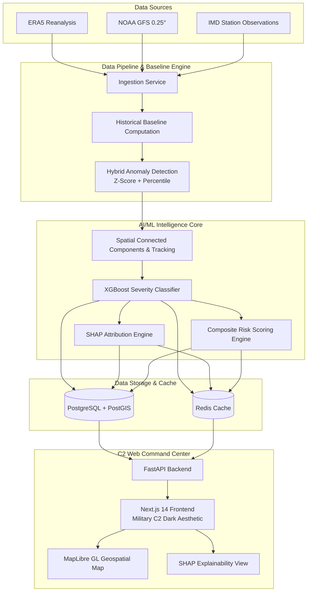

# AeroWatch — System Architecture

AeroWatch is an end-to-end Operational Weather Intelligence Command & Control system designed for disaster management authorities, municipal emergency teams, and infrastructure operators.

## High-Level Architecture Diagram

## Architectural Tenets

1. **Deterministic Hazard Association**: Spatial connected components identify contiguous anomaly masks while haversine-distance IoU trackers link phenomena sequentially across forecast horizons.
2. **Preventing Temporal Data Leakage**: All ML training and cross-validation strictly employ temporal splits and expanding window rolling splits.
3. **Explainable AI (XAI)**: Predictions are backed by local SHAP attributions highlighting meteorological drivers.
4. **Resilient Demo Mode**: Automatic fallback ensures operational command center displays remain responsive during network isolation.
