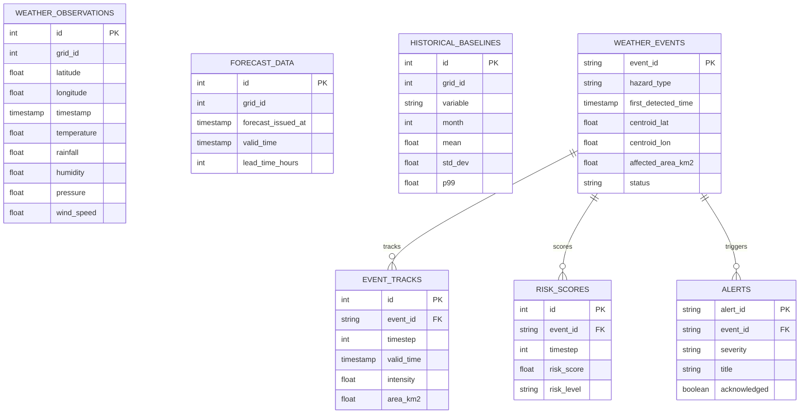

# AeroWatch — Database Schema Documentation

AeroWatch uses PostgreSQL 15+ with the PostGIS spatial extension.

## Entity Relationship Overview

## Table Specifications

1. **`weather_observations`**: Historical point observations (IMD, ERA5).
2. **`forecast_data`**: Multi-horizon numerical weather predictions (NOAA GFS, ECMWF).
3. **`historical_baselines`**: Climatological normal means, percentiles, standard deviations per grid and calendar month.
4. **`anomalies`**: Detected spatial anomalies with Z-scores and percentile ranks.
5. **`weather_events`**: Persistent weather events created via connected component clustering.
6. **`event_tracks`**: Temporal tracking states for events across 120-hour forecast horizons.
7. **`risk_scores`**: Composite risk index (0-100) and decomposed sub-indices.
8. **`model_predictions`**: XGBoost prediction results and SHAP attribution payloads.
9. **`alerts`**: Operational operator alerts with acknowledgment workflows.
10. **`administrative_boundaries`**: Administrative districts and states geometry.
11. **`system_status`**: Pipeline health telemetry.
